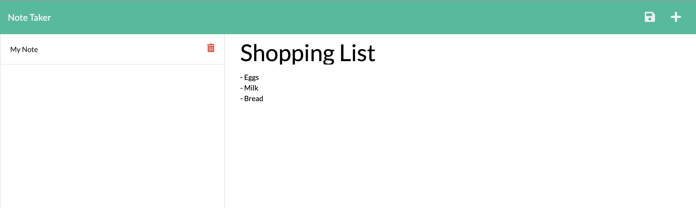

# Note Taker Application

## Description

This is an application that allows users to write and save notes, which assists users with keeping track of thoughts or tasks. It uses Express.js on the backend to store and display the data.
    
## Table of Contents
 - [Installation](#installation)
 - [Usage](#usage)
 - [License](#license)
 - [Contributing](#contributing)
 - [Tests](#tests)
 - [Questions](#questions)
    
    
## Installation

To use this application, navigate to the deployed [site](https://fast-citadel-06627.herokuapp.com/).

To install this application yourself, clone and download the files from this repository. Install the npm packages Express and UUID into the downloaded directory in order to run the program.
    
## Usage

If you use the application through the deployed [Heroku site](https://fast-citadel-06627.herokuapp.com/), simply navigate to and interact with the site. Click on 'Get Started,' and from there, you have the ability to write and title your own notes. View previous notes (or delete them) by clicking on them on the left-hand side, or write new notes by clicking on the plus in the upper-right-hand corner and then typing and saving a new memo.

If the program was cloned and downloaded, get the application running by typing "node server.js" into the command-line. All features of the application are then accessible through *localhost* on your browser or other applications.

*As the application prompts the user with questions, type in the answers and hit Enter.*

## License

This project is licensed under [MIT License](https://opensource.org/licenses/MIT).
    
## Credits

Starter front-end code provided by the University of Minnesota Coding Bootcamp.

## Questions

See more of my work on my [GitHub Profile](https://github.com/msteblu/).
For any additional questions, reach me at my email: megan@steblay.net.